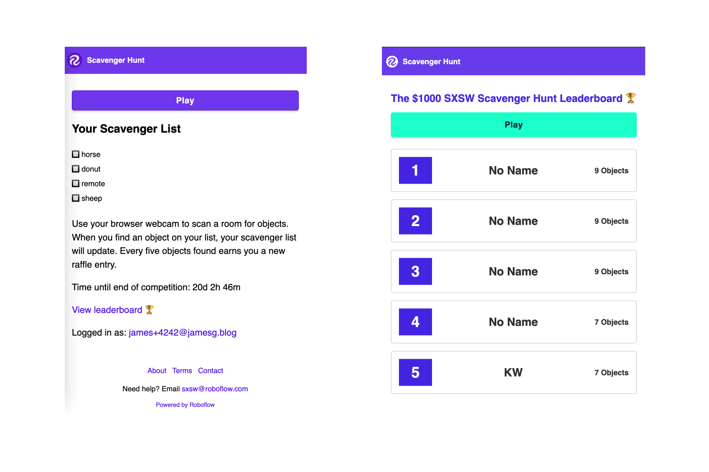

<div align="center">
    <a href="https://youtube.com/roboflow">
        
    </a>
    
    <a href="https://roboflow.com">
        
    </a>
    
    <a href="https://www.linkedin.com/company/roboflow-ai/">
        
    </a>
    
    <a href="https://docs.roboflow.com">
        
    </a>
    
    <a href="https://disuss.roboflow.com">
        
    
    <a href="https://blog.roboflow.com">
        
    </a>
    </a>
</div>

# SXSW + Roboflow Scavenger Hunt

This repository contains the code for the scavenger hunt run by Roboflow in celebration of SXSW 2023.

In this scavenger hunt, event participants are tasked with identifying five objects from the Microsoft COCO dataset. After identifying five objects, players are prompted with five more to identify. For every five objects identified, players are given an additional ticket to enter a contest to win $1,000.

This repository contains the source code for the application.



## Technologies Used

- [Supabase](https://supabase.io)
- [Node.js](https://nodejs.org/en/)
- [Express.js](https://expressjs.com/)
- [roboflow.js](https://docs.roboflow.com/inference/web-browser)

## Getting Started

To get started, you will need a Supabase account with three tables. The schema for these tables is in the `schema.sql` file in this repository. This schema file was generated using the following command:

```
pg_dump -h SUPABASE_DATABASE_URL -U postgres --data-only -n public -n auth > supabase_data.sql
```

You can ingest it into your Supabase project using the following command:

```
psql -f schema.sql -p PORT -U USERNAME DATABASE_NAME -h SUPABASE_DATABASE_URL
```

When you have the requisite tables, export the URL and key for your Supabase project as environment variables, as well as the port on which you want the application to run.

```
export SUPABASE_URL=""
export SUPABASE_KEY=""
export PORT=8080
```

Then, install the required dependencies:

```
npm install
```

Finally, run the application using Node:

```
node app.js
```

## License

This project is licensed under an [MIT license](LICENSE).